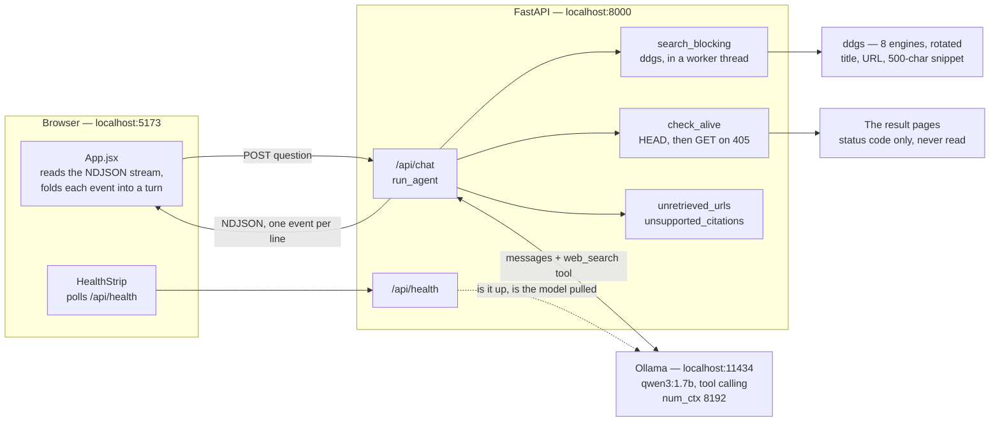
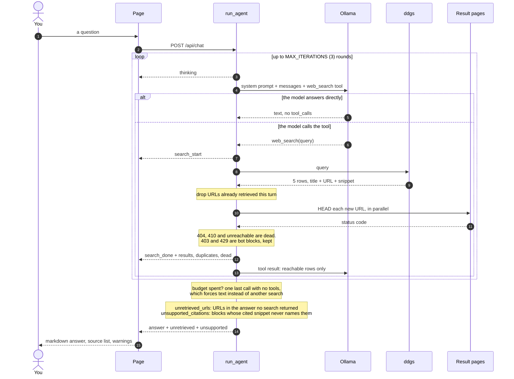
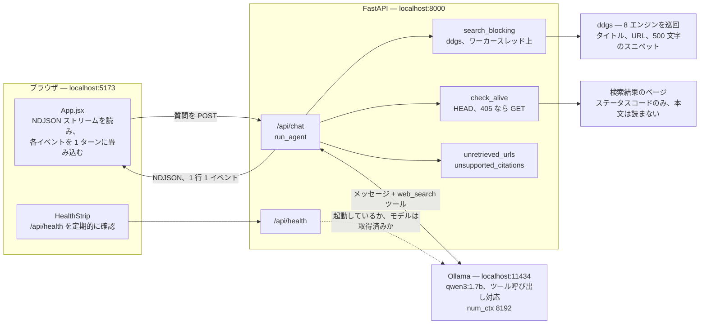
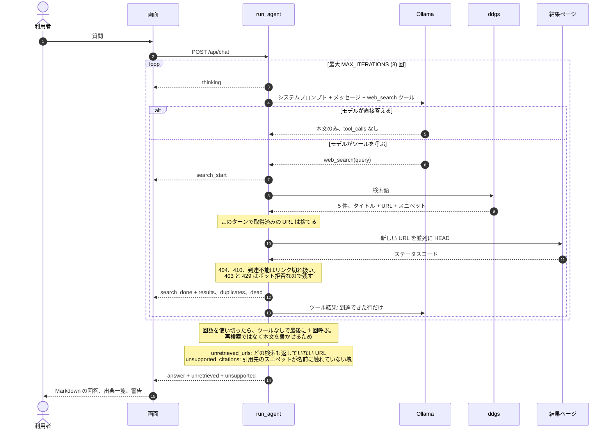

# Architecture

Two diagrams. The first is what the pieces are and who talks to whom; the second is what
happens between pressing Enter and reading an answer. A Japanese version of both follows.

## Components

The dashed edge is a liveness probe, nothing more. Ollama is the only thing running
outside this repo: `ddgs` is a library inside the backend process, so there is no search
service to be up or down.

## One request, end to end

What the model is given is the whole of what it knows: five titles and 500-character
snippets, about 600 tokens per search. No page is ever fetched, so the citation checks are
the only thing standing between a plausible sentence and a checked one.

---

# アーキテクチャ

図は二つ。一つ目は構成要素とその通信相手、二つ目は Enter を押してから答えが表示されるま
でに起きること。

## 構成要素

破線は死活監視だけを表す。このリポジトリの外で動くのは Ollama だけであり、`ddgs` は
バックエンドのプロセス内のライブラリなので、起動を確認すべき検索サービスは存在しない。

## リクエスト 1 件の流れ

モデルが持っている情報は、渡されたものがすべてである。タイトル 5 件と 500 文字のスニペッ
ト、検索 1 回あたり約 600 トークン。ページ本文は一度も取得しない。だから引用の検証だけが、
もっともらしい文と裏付けのある文とを分けている。
